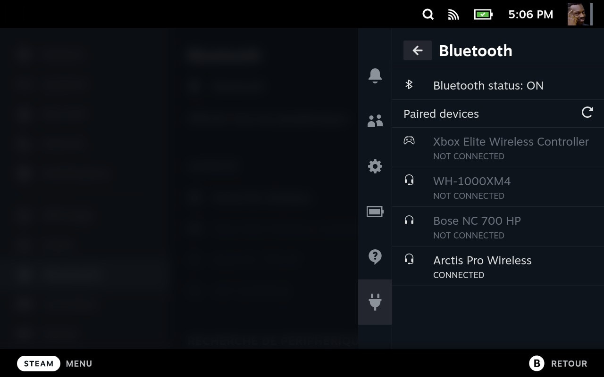

# Bluetooth plugin  
Formerly known as `SDH-Bluetooth`, this plugin allows you to quickly connect to already paired bluetooth devices.  
  
This saves one (yes ONE 1!) click instead of going trough the settings menu, but this should be faster when you're already in-game.  
If you can't see your device make sure you paired it once via the settings menu first, then it should appear.  
  
Under the hood it's just using bluetoothctl.  

## Installation  
Install it via https://plugins.deckbrew.xyz/  
  
## Planned features  
I've been thinking about adding a dedicated view to allow selecting the audio profile (as requested in #1).  
I would also like to include devices renaming.